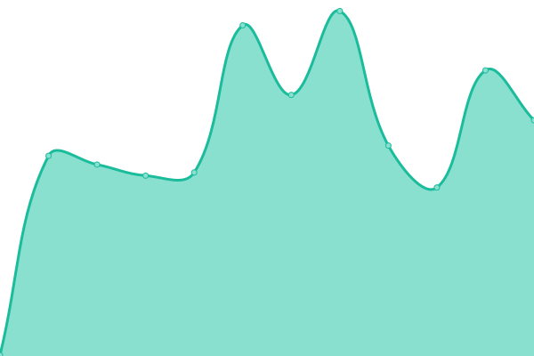
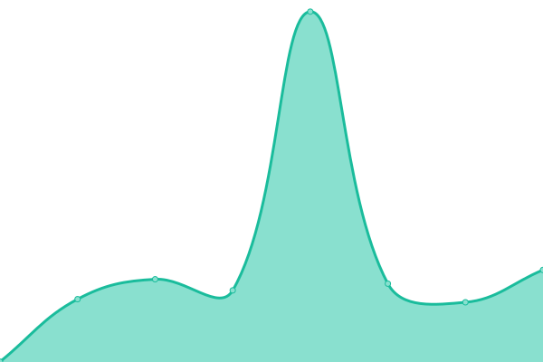
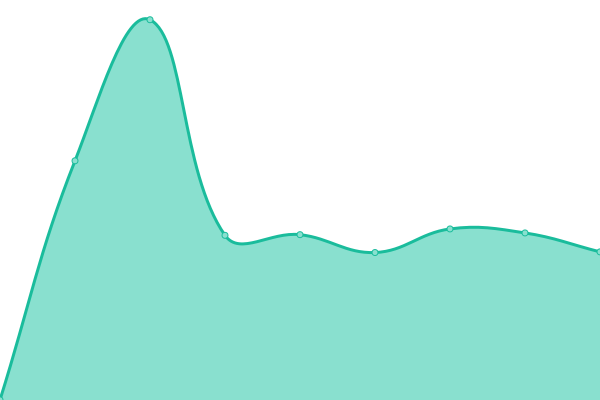
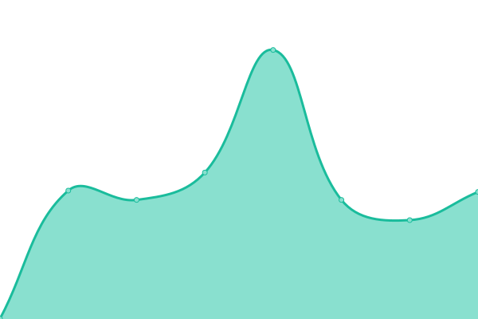
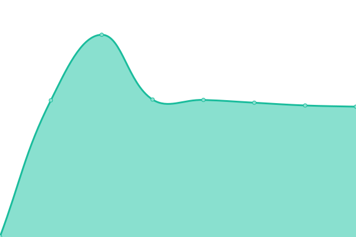
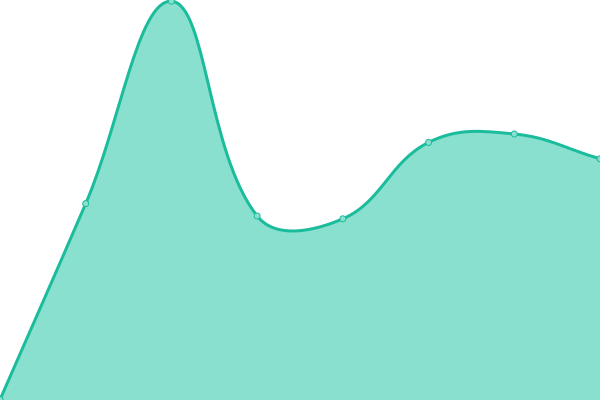
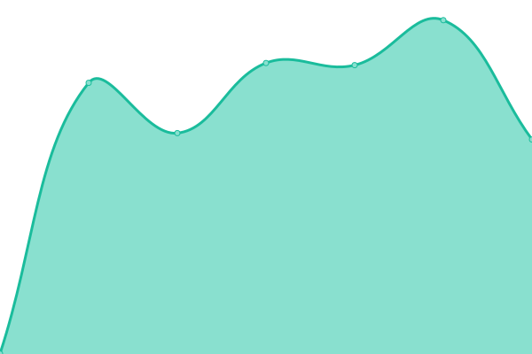

# [📈 Live Status](https://status.pastis-hosting.net): <!--live status--> **🟧 Partial outage**

<!--start: status pages-->
<!-- This summary is generated by Upptime (https://github.com/upptime/upptime) -->
<!-- Do not edit this manually, your changes will be overwritten -->
<!-- prettier-ignore -->
| URL | Status | History | Response Time | Uptime |
| --- | ------ | ------- | ------------- | ------ |
|  [pastis-hosting.net - docker](https://docker.pastis-hosting.net) | 🟥 Down | [pastis-hosting-net-docker.yml](https://github.com/constructions-incongrues/net.pastis-hosting.status/commits/HEAD/history/pastis-hosting-net-docker.yml) | 

 0ms
     
 | 

<a href="https://status.pastis-hosting.net/history/pastis-hosting-net-docker">100.00%</a>
    

|  [pastis-hosting.net - portainer](https://portainer.pastis-hosting.net) | 🟩 Up | [pastis-hosting-net-portainer.yml](https://github.com/constructions-incongrues/net.pastis-hosting.status/commits/HEAD/history/pastis-hosting-net-portainer.yml) | 

 423ms
     
 | 

<a href="https://status.pastis-hosting.net/history/pastis-hosting-net-portainer">100.00%</a>
    

|  [pastis-hosting.net - traefik](https://traefik.pastis-hosting.net) | 🟩 Up | [pastis-hosting-net-traefik.yml](https://github.com/constructions-incongrues/net.pastis-hosting.status/commits/HEAD/history/pastis-hosting-net-traefik.yml) | 

 509ms
     
 | 

<a href="https://status.pastis-hosting.net/history/pastis-hosting-net-traefik">100.00%</a>
    

|  [pastis-hosting.net - web](https://web.pastis-hosting.net) | 🟩 Up | [pastis-hosting-net-web.yml](https://github.com/constructions-incongrues/net.pastis-hosting.status/commits/HEAD/history/pastis-hosting-net-web.yml) | 

 301ms
     
 | 

<a href="https://status.pastis-hosting.net/history/pastis-hosting-net-web">100.00%</a>
    

|  [arrachetoiunoeil.com](https://www.arrachetoiunoeil.com) | 🟩 Up | [arrachetoiunoeil-com.yml](https://github.com/constructions-incongrues/net.pastis-hosting.status/commits/HEAD/history/arrachetoiunoeil-com.yml) | 

 1347ms
     
 | 

<a href="https://status.pastis-hosting.net/history/arrachetoiunoeil-com">100.00%</a>
    

|  [daheardit-records.net - api](https://api.daheardit-records.net) | 🟩 Up | [daheardit-records-net-api.yml](https://github.com/constructions-incongrues/net.pastis-hosting.status/commits/HEAD/history/daheardit-records-net-api.yml) | 

 331ms
     
 | 

<a href="https://status.pastis-hosting.net/history/daheardit-records-net-api">100.00%</a>
    

|  [daheardit-records.net - www](https://www.daheardit-records.net) | 🟩 Up | [daheardit-records-net-www.yml](https://github.com/constructions-incongrues/net.pastis-hosting.status/commits/HEAD/history/daheardit-records-net-www.yml) | 

 1123ms
     
 | 

<a href="https://status.pastis-hosting.net/history/daheardit-records-net-www">100.00%</a>
    

|  [mazemod.org](https://www.mazemod.org) | 🟩 Up | [mazemod-org.yml](https://github.com/constructions-incongrues/net.pastis-hosting.status/commits/HEAD/history/mazemod-org.yml) | 

 391ms
     
 | 

<a href="https://status.pastis-hosting.net/history/mazemod-org">100.00%</a>
    

|  [musiques-incongrues.net](https://www.musiques-incongrues.net) | 🟩 Up | [musiques-incongrues-net.yml](https://github.com/constructions-incongrues/net.pastis-hosting.status/commits/HEAD/history/musiques-incongrues-net.yml) | 

 1823ms
     
 | 

<a href="https://status.pastis-hosting.net/history/musiques-incongrues-net">100.00%</a>
    

|  [musiques-incongrues.net - data](https://data.musiques-incongrues.net) | 🟥 Down | [musiques-incongrues-net-data.yml](https://github.com/constructions-incongrues/net.pastis-hosting.status/commits/HEAD/history/musiques-incongrues-net-data.yml) | 

 632ms
     
 | 

<a href="https://status.pastis-hosting.net/history/musiques-incongrues-net-data">100.00%</a>
    

|  [musiques-incongrues.net - manager2000](https://manager2000.musiques-incongrues.net) | 🟩 Up | [musiques-incongrues-net-manager2000.yml](https://github.com/constructions-incongrues/net.pastis-hosting.status/commits/HEAD/history/musiques-incongrues-net-manager2000.yml) | 

 499ms
     
 | 

<a href="https://status.pastis-hosting.net/history/musiques-incongrues-net-manager2000">100.00%</a>
    

|  [musiques-incongrues.net - simbertier](https://simbertier.musiques-incongrues.net) | 🟩 Up | [musiques-incongrues-net-simbertier.yml](https://github.com/constructions-incongrues/net.pastis-hosting.status/commits/HEAD/history/musiques-incongrues-net-simbertier.yml) | 

 569ms
     
 | 

<a href="https://status.pastis-hosting.net/history/musiques-incongrues-net-simbertier">100.00%</a>
    

|  [musiques-incongrues.net - zeitgeist](https://zeitgeist.musiques-incongrues.net) | 🟩 Up | [musiques-incongrues-net-zeitgeist.yml](https://github.com/constructions-incongrues/net.pastis-hosting.status/commits/HEAD/history/musiques-incongrues-net-zeitgeist.yml) | 

 1551ms
     
 | 

<a href="https://status.pastis-hosting.net/history/musiques-incongrues-net-zeitgeist">100.00%</a>
    

|  [musiqueapproximative.net](https://www.musiqueapproximative.net) | 🟩 Up | [musiqueapproximative-net.yml](https://github.com/constructions-incongrues/net.pastis-hosting.status/commits/HEAD/history/musiqueapproximative-net.yml) | 

 1222ms
     
 | 

<a href="https://status.pastis-hosting.net/history/musiqueapproximative-net">100.00%</a>
    

|  [musiqueapproximative.net - quickoschantenoel](https://quickoschantenoel.musiqueapproximative.net) | 🟩 Up | [musiqueapproximative-net-quickoschantenoel.yml](https://github.com/constructions-incongrues/net.pastis-hosting.status/commits/HEAD/history/musiqueapproximative-net-quickoschantenoel.yml) | 

 1688ms
     
 | 

<a href="https://status.pastis-hosting.net/history/musiqueapproximative-net-quickoschantenoel">100.00%</a>
    

|  [musiqueapproximative.net - radio](https://radio.musiqueapproximative.net) | 🟩 Up | [musiqueapproximative-net-radio.yml](https://github.com/constructions-incongrues/net.pastis-hosting.status/commits/HEAD/history/musiqueapproximative-net-radio.yml) | 

 693ms
     
 | 

<a href="https://status.pastis-hosting.net/history/musiqueapproximative-net-radio">100.00%</a>
    

|  [ilmanquedesmots.fr - www](https://www.ilmanquedesmots.fr) | 🟥 Down | [ilmanquedesmots-fr-www.yml](https://github.com/constructions-incongrues/net.pastis-hosting.status/commits/HEAD/history/ilmanquedesmots-fr-www.yml) | 

 0ms
     
 | 

<a href="https://status.pastis-hosting.net/history/ilmanquedesmots-fr-www">100.00%</a>
    

|  [ilmanquedesmots.fr - enlivrezvous](https://enlivrezvous.ilmanquedesmots.fr) | 🟥 Down | [ilmanquedesmots-fr-enlivrezvous.yml](https://github.com/constructions-incongrues/net.pastis-hosting.status/commits/HEAD/history/ilmanquedesmots-fr-enlivrezvous.yml) | 

 0ms
     
 | 

<a href="https://status.pastis-hosting.net/history/ilmanquedesmots-fr-enlivrezvous">100.00%</a>
    

|  [ilmanquedesmots.fr - grandirdansdeschamps](https://grandirdansdeschamps.ilmanquedesmots.fr) | 🟥 Down | [ilmanquedesmots-fr-grandirdansdeschamps.yml](https://github.com/constructions-incongrues/net.pastis-hosting.status/commits/HEAD/history/ilmanquedesmots-fr-grandirdansdeschamps.yml) | 

 0ms
     
 | 

<a href="https://status.pastis-hosting.net/history/ilmanquedesmots-fr-grandirdansdeschamps">100.00%</a>
    

|  [www.leseditionsduchevet.fr](https://www.leseditionsduchevet.fr) | 🟩 Up | [www-leseditionsduchevet-fr.yml](https://github.com/constructions-incongrues/net.pastis-hosting.status/commits/HEAD/history/www-leseditionsduchevet-fr.yml) | 

 431ms
     
 | 

<a href="https://status.pastis-hosting.net/history/www-leseditionsduchevet-fr">100.00%</a>
    

|  [www.ouiedire.net](https://www.ouiedire.net) | 🟩 Up | [www-ouiedire-net.yml](https://github.com/constructions-incongrues/net.pastis-hosting.status/commits/HEAD/history/www-ouiedire-net.yml) | 

 1043ms
     
 | 

<a href="https://status.pastis-hosting.net/history/www-ouiedire-net">100.00%</a>
    

|  [parishq.net](https://parishq.net) | 🟩 Up | [parishq-net.yml](https://github.com/constructions-incongrues/net.pastis-hosting.status/commits/HEAD/history/parishq-net.yml) | 

 676ms
     
 | 

<a href="https://status.pastis-hosting.net/history/parishq-net">100.00%</a>
    

|  [parishq.net - computertruck](https://computertruck.parishq.net) | 🟩 Up | [parishq-net-computertruck.yml](https://github.com/constructions-incongrues/net.pastis-hosting.status/commits/HEAD/history/parishq-net-computertruck.yml) | 

 703ms
     
 | 

<a href="https://status.pastis-hosting.net/history/parishq-net-computertruck">100.00%</a>
    

|  [parishq.net - divag](https://divag.parishq.net) | 🟩 Up | [parishq-net-divag.yml](https://github.com/constructions-incongrues/net.pastis-hosting.status/commits/HEAD/history/parishq-net-divag.yml) | 

 779ms
     
 | 

<a href="https://status.pastis-hosting.net/history/parishq-net-divag">100.00%</a>
    

|  [parishq.net - gallery](https://gallery.parishq.net) | 🟩 Up | [parishq-net-gallery.yml](https://github.com/constructions-incongrues/net.pastis-hosting.status/commits/HEAD/history/parishq-net-gallery.yml) | 

 585ms
     
 | 

<a href="https://status.pastis-hosting.net/history/parishq-net-gallery">100.00%</a>
    

|  [parishq.net - labitabertier](https://labitabertier.parishq.net) | 🟩 Up | [parishq-net-labitabertier.yml](https://github.com/constructions-incongrues/net.pastis-hosting.status/commits/HEAD/history/parishq-net-labitabertier.yml) | 

 581ms
     
 | 

<a href="https://status.pastis-hosting.net/history/parishq-net-labitabertier">100.00%</a>
    

<!--end: status pages-->

[**Visit our status website →**](https://status.pastis-hosting.net)

## 📄 License

- Powered by: [Upptime](https://github.com/upptime/upptime)
- Code: [MIT](./LICENSE) © [Constructions Incongrues](http://www.constructions-incongrues.net)
- Data in the `./history` directory: [Open Database License](https://opendatacommons.org/licenses/odbl/1-0/)
